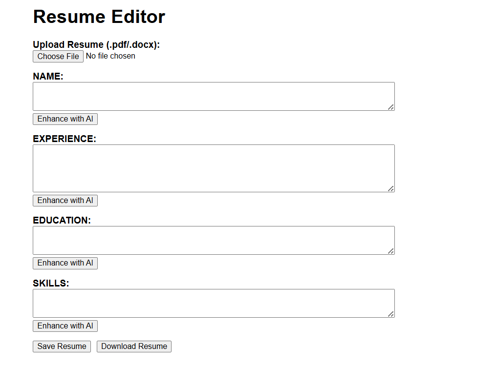
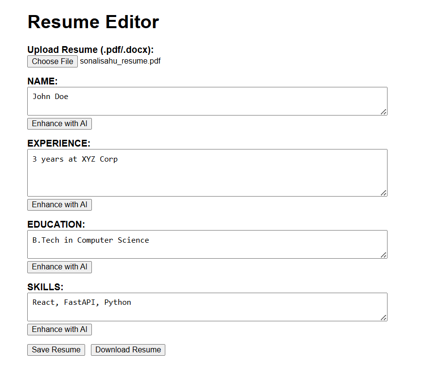
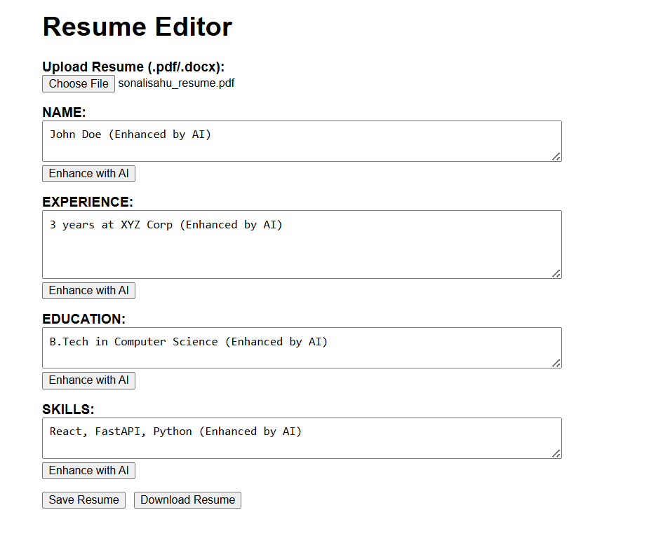
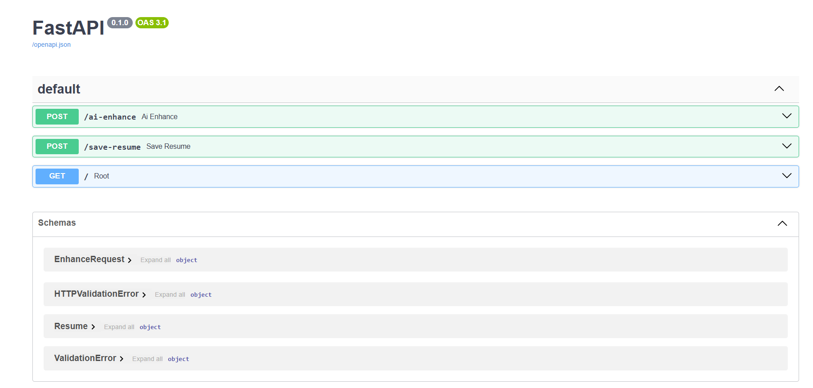

# Resume Editor Project ✨

A **React + FastAPI** application to upload, edit, and enhance resumes using AI.

## 🚀 Features
✅ Upload resume in PDF/text.  
✅ Edit resume sections easily.  
✅ AI-powered enhancement for resumes.  
✅ Clean, responsive frontend (React).  
✅ Fast, lightweight backend (FastAPI).

## 🛠️ Technologies
- Frontend: React, JavaScript, CSS
- Backend: FastAPI, Python
- API: REST (JSON)

## 🖥️ Local Setup

### 1️⃣ Clone Repository
```bash
git clone https://github.com/SONALI-SAHU04/ResumeEditorProject.git
cd ResumeEditorProject


## 📸 Screenshots

### 🏠 Home Page


### 📤 Upload Resume Page


### ✨ After Enhancement


### ⚡ FastAPI Swagger Docs



